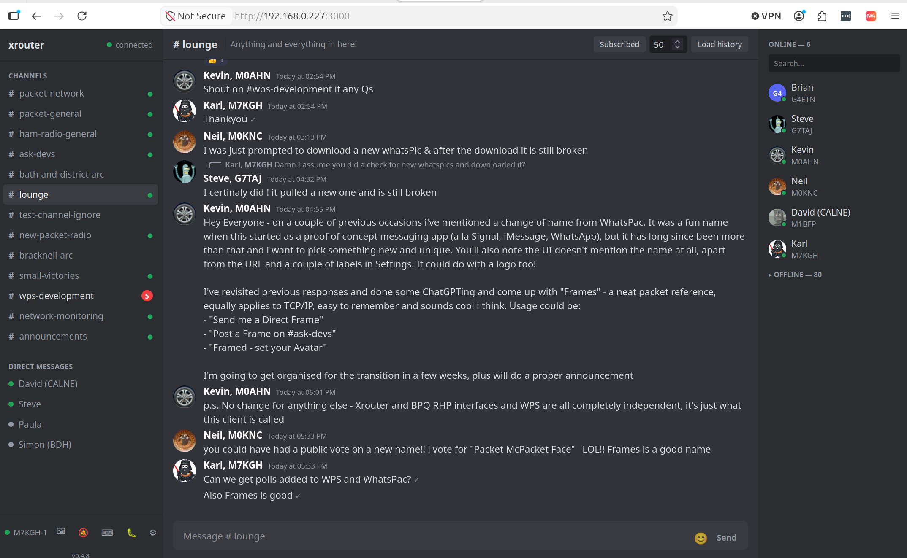

# Pacord

A Discord-inspired chat client for **WhatsPac** (WPS), the packet-radio chat service reachable through an **XRouter** (or BPQ) node. Runs as a small Node backend — it owns the live XRouter connection plus a local SQLite file — with a React frontend, so it can be hosted once (e.g. on a Raspberry Pi) and used from any browser on the LAN with shared, persistent history and connection profiles.

This is **not** WhatsApp. WhatsPac is a text chat service for the amateur packet-radio network (channels + DMs, like Discord/IRC), published from an XRouter/BPQ node and reachable over AX.25/NET-ROM.



## Quick start (Docker)

Pre-built images for x86-64, Raspberry Pi 4/5 (arm64), and Pi 3 (armv7) are published automatically on every push to `main`.

### 1. Install Docker

**Raspberry Pi / Debian / Ubuntu:**

```bash
curl -fsSL https://get.docker.com | sudo sh
sudo usermod -aG docker $USER   # lets you run docker without sudo (re-login after)
```

**Other platforms:** see [docs.docker.com/get-docker](https://docs.docker.com/get-docker/).

Docker Compose is included with Docker Desktop on Mac/Windows. On Linux the script above installs the `docker compose` plugin automatically.

### 2. Run Pacord

```bash
curl -O https://raw.githubusercontent.com/kghunt/pacord/main/docker-compose.yml
sudo docker compose up -d
```

Then open `http://localhost:3000` (or `http://<pi-ip>:3000` from any device on your LAN).

Your connection profiles and chat history are stored in the `pacord-data` Docker volume and survive updates. To change the port, edit `docker-compose.yml` and replace the left-hand `3000` (e.g. `"8080:3000"`).

**To update:**

```bash
sudo docker compose pull && sudo docker compose up -d --pull always
```

---

## Features

- Discord-style UI: channels + DMs in a sidebar, message pane with replies/edits/reactions, online-users list
- Real emoji reactions with a full searchable picker (native emoji rendering, no external image loading)
- Avatar images, fetched on request (see [Avatars](#avatars) below — deliberately not automatic)
- An embedded terminal panel that shows the XRouter node's own live console/monitor, so you don't need a separate tab to watch what's happening on the radio side
- Connection profiles stored server-side (not per-browser), so every device on the LAN sees the same history and doesn't need to be reconfigured

## Requirements

- Node.js >= 22.15 (uses the built-in `node:sqlite` module — no native build tools needed, which matters a lot for painless Raspberry Pi deployment)

## Development

```bash
npm install
npm run dev
```

Runs the backend (`tsx watch`, port 3000) and the Vite dev server (port 5173, proxying `/api` and `/ws` to the backend) together. Open http://localhost:5173.

## Production / Pi deployment

```bash
npm install
npm run build
npm start
```

Serves everything (API + built frontend) on a single port (default 3000). Open `http://<pi-ip>:3000` from any device on the LAN.

The SQLite database lives at `data/pacord.db` — back it up if you want to preserve connection profiles and chat history. It's excluded from git on purpose (contains your callsign, saved connection details, and message history).

### Running at boot (systemd)

```ini
[Unit]
Description=Pacord
After=network.target

[Service]
WorkingDirectory=/home/pi/pacord
ExecStart=/usr/bin/node dist/server/index.js
Restart=on-failure
Environment=NODE_ENV=production

[Install]
WantedBy=multi-user.target
```

```bash
sudo systemctl daemon-reload
sudo systemctl enable --now pacord
```

## Configuring a connection profile

Everything is configured from the UI (⚙ in the sidebar → Connection Profiles). No config files to hand-edit. Key fields:

- **Callsign / Display name** — your identity on the network
- **Transport** — `rhp-ws` (WebSocket) or `rhp-tcp` (raw, length-prefixed TCP). **This is the single most important setting to get right** — see the gotcha below.
- **Host / Port** — where the node's RHP service listens
- **Link level** — `L2` (direct AX.25) or `L4` (NET-ROM, routed)
- **Remote** — the AX.25/NET-ROM destination for the initial connect
- **Multi-hop connect script** (Advanced) — a sequence of `{cmd, val}` steps typed at a node console after connecting, each waiting for `val` to appear before sending the next `cmd`. Needed when WPS isn't hosted on the node you connect through.
- **Response timeout** — how long to wait for a reply before giving up. RF links vary wildly (near-instant to 30-60s) — tune this to your link.
- **Admin/Terminal port** — the node's web admin port (commonly 8086), used only for the in-app Terminal panel.

### The RHP-WS vs RHP-TCP gotcha

whatspyc's own docs treat `rhp-ws` (WebSocket) as conventionally living on port 8086 and `rhp-tcp` (raw 2-byte length-prefixed framing) on port 9000 — but that's just convention, not a protocol rule. **What actually matters is what your node's `RHPPORT` config directive in `XROUTER.CFG` serves**, which can be either transport on any port. We hit this directly: a node configured with `RHPPORT=0 9000` turned out to be serving **RHP-over-WebSocket on port 9000**, not raw TCP. Symptom if you get this wrong: connections either fail outright, or open successfully but silently reject any destination callsign carrying an SSID (errCode 4, "No memory") while bare callsigns connect but never send data.

If your connection profile isn't working: check what `RHPPORT` actually points to on the node, and try both `rhp-ws` and `rhp-tcp` against that port before assuming the destination/callsign config is wrong. A `tcpdump -i any -A -s 0 'tcp port <port>'` capture on the node while connecting with a known-working client (e.g. the reference WhatsPac web client) is the fastest way to get ground truth — look for whether the connection starts with `GET /rhp HTTP/1.1 ... Upgrade: websocket` (WS) or raw JSON immediately (TCP framing).

### Reaching a WPS host on a different node

If WPS isn't hosted on the node you connect through, the connect script needs to land you at a node console and type a `C <callsign>` command to hop onward — bare AX.25 connects to a **node's own callsign** are silent by design (no banner), while connecting to a node's **alias** (shown on its web admin as e.g. `SWINDN-1`) does send one. Concretely, a working script often looks like:

- `remote`: the alias of the intermediate node (e.g. `SWINDN-1`)
- Hop 1: empty command, wait for the node's banner text (e.g. `"Type ? for list of other commands"`)
- Hop 2: `C <WPS-host-callsign>`, wait for `"*** Connected"`

## Channel subscriptions

Viewing a channel only shows locally cached history — it does **not** subscribe you. Subscribing (the explicit button in the channel header) is what triggers a live feed and a history backfill, since that pulls real data over the radio link. Same principle applies to on-demand "Load history" for a specific message count.

## Avatars

Avatar images are fetched from WPS on request, never automatically — each one is a large transfer (tens of KB) sent as a single continuous frame over the link, and a node can have dozens of avatars, so downloading all of them can take several minutes on a slow link. Use the 🖼 icon in the sidebar: "Check count" is cheap, "Download new avatars" only pulls what's changed since your last download. Avatars appear on messages and the online-users list live, as each one finishes — no need to wait for the whole batch.

## Protocol notes (for anyone extending this)

The backend (`src/server/protocol/`) is a from-scratch TypeScript port of the WPS/RHP wire protocol, reverse-engineered from [whatspyc](https://github.com/allthefurlongs/whatspyc)'s Python source (the XRouter wiki doesn't document RHP/WPS in useful detail) and validated against real traffic captures. A few things worth knowing if you're debugging or extending it:

- **WPS strips SSIDs at the application layer.** The RHP/AX.25 *link* layer needs your full callsign-SSID (e.g. `M7KGH-2`) for `local` in the RHP `OPEN`, but every WPS-layer field (connect record, message `fc`/`tc`, reaction attribution) must use the bare callsign, or you'll show up as a different "user" than your actual identity and miss your own ham-directory entry. See `WpsClient.appCall` in `src/server/protocol/wpsClient.ts`.
- **Avatar payloads have an undocumented prefix.** Empirically, avatar image data arrives with roughly 16 extra bytes before the real image (looks like an MD5 checksum) — `src/server/db/avatars.ts` searches for a known image signature (JPEG/PNG/GIF) rather than assuming a fixed offset, and strips whatever precedes it.
- **A connection "succeeding" isn't proof it's healthy.** The RHP `openReply` only confirms local resource allocation, not that the far end ever answers — treating that as "connected" for reconnect-backoff purposes causes a fast connect/fail loop on a flaky link. The client requires ~15s of stable uptime before resetting its reconnect backoff.

## Environment variables

- `PORT` — HTTP port (default `3000`)
- `DATA_DIR` — where the SQLite file and channel seed live (default `./data`)
